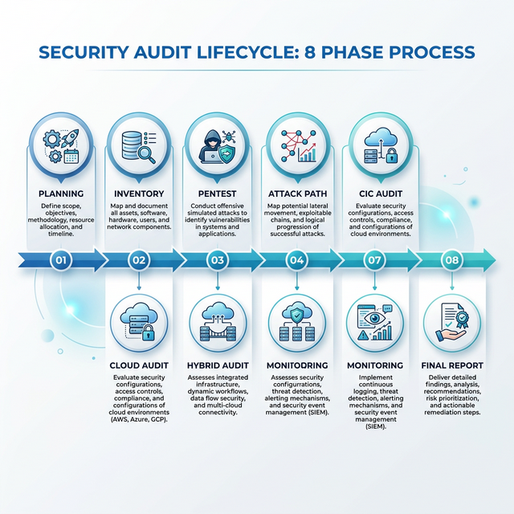

# 🛡️ Audit-Azure-check: Repository Clé-en-main

[](https://opensource.org/licenses/MIT)
[](#)

Ce projet fournit une solution **clé-en-main** pour mener un audit avancé et complet d’un environnement **Active Directory (AD)** hybride (*on-premises + Azure*).


*Figure 1: Concept d'Architecture d'Audit Hybride AD & Azure.*

---

## 🚀 Fonctionnalités Clés

- **Méthodologie Détaillée** : 8 phases inspirées des standards Mandiant/Big4.
- **Checklists Exhaustives** : Plus de 200 points de contrôle (AD, Entra ID, Hybride).
- **Automatisation** : Scripts PowerShell, Azure CLI et Python pour la collecte de données.
- **Visualisation** : Diagrammes Attack Path et schémas d'architecture.
- **Templates de Rapports** : Modèles prêts à l'emploi (Executive Summary, Remédiation).

---

## 🗺️ Méthodologie d'Audit (8 Phases)

Le kit d'audit suit une approche itérative rigoureuse :

1.  **Planification & Kickoff** (2-3 jours)
2.  **Inventaire AD On-Prem** (3-5 jours)
3.  **Pentest & Énumérations** (5-7 jours)
4.  **Attack Path Modeling** (2-3 jours)
5.  **Audit Azure AD / Entra ID** (3-5 jours)
6.  **Audit Hybrid Identity** (1-2 jours)
7.  **Monitoring & Détection** (2-3 jours)
8.  **Rapport & Remédiation** (3-5 jours)



[Consulter la méthodologie détaillée dans docs/methodology.md](docs/methodology.md)

---

## 🔍 Visualisation des Chemins d'Attaque

Grâce à BloodHound et SharpHound, nous cartographions les chemins d'escalade possibles vers les privilèges de type `Domain Admin`.


*Figure 2: Exemple de visualisation de chemin d'attaque (Attack Path).*

---

## 📋 Checklists de Contrôle

Les contrôles sont organisés par domaines critiques :

- **Architecture AD** : DCs, FSMO, Trusts.
- **Identités Cloud** : MFA, Conditional Access, Roles Entra ID.
- **Infrastructure Hybride** : Azure AD Connect, PHS/PTA.

[Voir toutes les checklists dans checklists/](checklists/)

---

## 🛠️ Installation & Usage rapide

Pour télécharger et initialiser ce repository localement, utilisez la commande suivante :

```powershell
git clone https://github.com/valentinowyhnel/Audit-Azure-check.git
cd Audit-Azure-check
```

### Script de Téléchargement Direct
Si vous n'avez pas Git installé, vous pouvez utiliser ce script PowerShell pour télécharger le kit complet :

```powershell
Invoke-WebRequest -Uri "https://github.com/valentinowyhnel/Audit-Azure-check/archive/refs/heads/main.zip" -OutFile "Audit-Azure-check.zip"; Expand-Archive -Path "Audit-Azure-check.zip" -DestinationPath "."
```

---

## 📄 Licence

Distribué sous la licence MIT. Voir `LICENSE` pour plus d'informations.

---

*Développé avec ❤️ pour les équipes SecOps et Red Team.*
