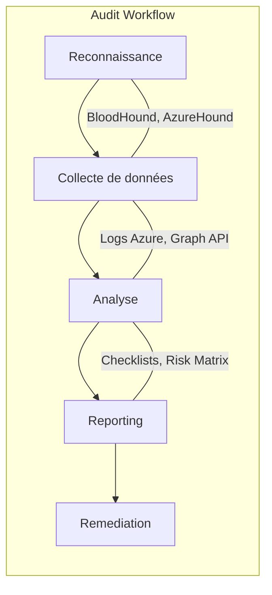

# 🛡️ Audit-Azure-check: Repository Clé-en-main

[](https://opensource.org/licenses/MIT)
[](#)

## 📝 Executive Summary
Ce rapport rassemble une collection de ressources et d’outils pour conduire un audit avancé d’**Active Directory (AD) hybride sur Azure**. Il propose une structure de dépôt GitHub prête à l’emploi, une méthodologie inspirée des pratiques **Big4/Mandiant**, des checklists détaillées (200+ contrôles), et des scripts automatisés.


---

## 🛠️ Outils Recommandés (Top Tiers)

| Outil | Description | Target |
| :--- | :--- | :--- |
| **Prowler** | Audit de conformité multi-cloud (CIS, NIST). | Azure/Multi-Cloud |
| **BloodHound CE** | Analyse graphique des chemins d'attaque. | AD / Entra ID |
| **AADInternals** | Administration et extraction de secrets (PTA/PHS). | Entra ID / M365 |
| **PingCastle** | État de santé et sécurité Active Directory. | AD On-Prem |

[Découvrir tous les outils dans docs/tools.md](docs/tools.md)

---

## 🧭 Navigation dans le Repository

- **[docs/methodology.md](docs/methodology.md)** : Méthodologie en 8 phases et hypothèses d'audit.
- **[docs/resources.md](docs/resources.md)** : Plus de 30+ liens vers des tutoriels, blogs et docs Microsoft.
- **[docs/playbooks.md](docs/playbooks.md)** : Analyses d'attaques (MFA Bypass, OAuth, etc.).
- **[checklists/](checklists/)** : Points de contrôle en format Markdown et JSON.

---

## 📊 Flux d'Audit (Mermaid)



---

## 🛠️ Installation & Usage rapide

```powershell
git clone https://github.com/valentinowyhnel/Audit-Azure-check.git
cd Audit-Azure-check
```

### Téléchargement Direct (sans Git)
```powershell
Invoke-WebRequest -Uri "https://github.com/valentinowyhnel/Audit-Azure-check/archive/refs/heads/main.zip" -OutFile "Audit-Azure-check.zip"; Expand-Archive -Path "Audit-Azure-check.zip" -DestinationPath "."
```

---

## 📄 Licence
Distribué sous la licence MIT. Voir `LICENSE`.
